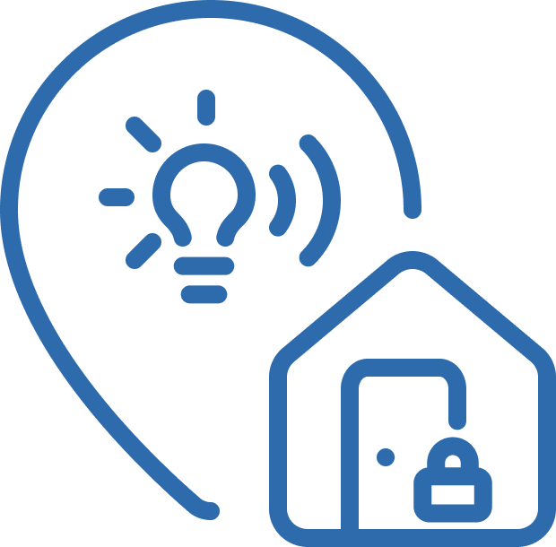

<h1>
<p align="center">
  
  <br>Varko
</h1>
  <p align="center">
    Pametna simulacija prisotnosti stanovalcev za preprečitev vlomov.
    <br />
    <a href="./docs">Dokumentacija</a>
    ·
    <a href="./src">Izvorna koda</a>
    ·
    <a href="./test">Testni primeri</a>
  </p>
</p>

## Kazalo

- [Opis](#opis)
- [Predstavitev](#predstavitev)
- [⚙️ Navodila za namestitev sistema](#navodila-za-namestitev-sistema)
    - [1. Prenos integracije](#1-prenos-integracije)
    - [2. Nastavitev IP naslova varnostne kamere](#2-nastavitev-ip-naslova-varnostne-kamere)
    - [3. Zagon sistema](#3-zagon-sistema)
    - [4. Dostop do sistema](#4-dostop-do-sistema)
    - [5. Dodajanje integracije Varko](#5-dodajanje-integracije-varko)
    - [6. Dostop do uporabniškega vmesnika Varko](#6-dostop-do-uporabniškega-vmesnika-varko)
    - [7. Ustavitev sistema](#7-ustavitev-sistema)
- [🛠️ Navodila za upravljanje s sistemom](#navodila-za-upravljanje-s-sistemom)
    - [👤 Upravljanje skupine uporabnikov Varko](#upravljanje-skupine-uporabnikov-varko)
        - [Dodajanje osebe v skupino uporabnikov Varko:](#dodajanje-osebe-v-skupino-uporabnikov-varko)
        - [Odstanjevanje osebe iz skupine uporabnikov Varko:](#odstanjevanje-osebe-iz-skupine-uporabnikov-varko)
    - [📍 Upravljanje varnostnih con v sistemu Varko](#upravljanje-varnostnih-con-v-sistemu-varko)
        - [Izbira aktivne cone](#izbira-aktivne-cone)
    - [💡 Upravljanje naprav v sistemu Varko](#upravljanje-naprav-v-sistemu-varko)
        - [Dodajanje pametne luči](#dodajanje-pametne-luči)
        - [Dodajanje multimedijske naprave (Google Cast)](#dodajanje-multimedijske-naprave-google-cast)
        - [Upravljanje obstoječih naprav (odstranitev, vključitev/izključitev iz simulacije)](#upravljanje-obstoječih-naprav-odstranitev-vključitevizključitev-iz-simulacije)
        - [Izbira radijske postaje](#izbira-radijske-postaje)
    - [🕹️ Ročno upravljanje sistema](#ročno-upravljanje-sistema)
        - [Preklop stanja sistema](#preklop-stanja-sistema)
- [Licenca](#licenca)

## Opis

Varko predstavlja integracijo za sistem Home Assistant, ki omogoča dinamično simulacijo prisotnosti uporabnikov objekta z uporabo obstoječih pametnih naprav v domu (kot so luči, zvočniki). Sistem upošteva kontekstne dejavnike, kot sta čas dneva in lokacija vseh uporabnikov, ter se aktivira ob zaznavi potencialnih neželenih oseb v okolici objekta, kadar so vsi uporabniki odsotni. S tem ustvarja vtis, da je nekdo v objektu, kar odvrača morebitne vlomilce. Rešitev je zaradi načina delovanja energetsko učinkovitejša in bolj zanesljiva od tradicionalnih metod, kot sta puščanje prižganih naprav in preverjanja stanja objekta s strani sosedov.

## Predstavitev

Povezava do predstavitve: https://docs.google.com/presentation/d/14XnFlt9IAhx2DBIEt5mu1Ob6igIXcELEbPF5od7so2U/edit

Povezava do javne postavitve Home Assistant z integracijo: https://homeassistant.wideuc.si:8123
- Uporabniško ime: `tpo`
- Geslo: `rebugging`


## ⚙️ Navodila za namestitev sistema

Zahteve:
- Docker in Docker Compose
- Mobilna aplikacija Home Assistant
- Kamera s podporo RTSP
- Pametne naprave (luči, Chromecast)


### 1. Prenos integracije

Najprej klonirajte repozitorij iz GitHub-a:

```bash
git clone https://github.com/TPO-2024-2025/Projekt-20.git
```

### 2. Nastavitev IP naslova varnostne kamere

V konfiguracijski datoteki je potrebno nastaviti IP naslov kamere, preko katerega prenaša video tok preko RTSP protokola:

Odprite datoteko `config/frigate/config.dev.yaml` in poiščite vrstico:

```yaml
- path: rtsp://0.0.0.0:8553/stream # RTSP stream URL
```

Zamenjajte IP naslov 0.0.0.0 z dejanskim IP naslovom vaše RTSP kamere, na primer:

```yaml
- path: rtsp://192.168.1.100:8553/stream # RTSP stream URL
```

**Opomba:** Poskrbite, da je IP naslov dostopen iz omrežja, kjer bo deloval sistem Varko.

### 3. Zagon sistema

Za zagon vseh potrebnih komponent sistema uporabite ukaz:

```bash
make start-dev
```

Ta ukaz bo s pomočjo Docker zagnal naslednje komponente:
- Home Assistant
- MQTT Broker
- Frigate (video analiza in zaznava oseb)

### 4. Dostop do sistema

Po uspešnem zagonu lahko dostopate do Home Assistant uporabniškega vmesnika na naslovu http://localhost:8123.

### 5. Dodajanje integracije Varko

Ob dodajanju integracije boste pozvani k nastavitvi **trajanja simulacije prisotnosti** – to je čas, v katerem sistem simulira prisotnost po zaznavi osebe v okolici doma.  
Privzeta vrednost je **30 minut**, kar pomeni, da bo Varko 30 minut po zaznavi izvajal simulacijo (prižgane luči ali predvajanje glasbe), da bi odvrnil morebitne vsiljivce (v kolikor se sistem ne bi prožil ponovno in ponastavil časovnik).

### 6. Dostop do uporabniškega vmesnika Varko

Uspešno ste namestili našo integracijo. Sistem lahko upravljate preko uporabniškega vmesnika Varko.

### 7. Dodajanje in konfiguracija integracije MQTT

Sistem za komunikacijo z zunanjimi napravami ter prejemanje obvestil o zaznavi oseb potrebuje ustrezno nastavljeno MQTT konfiguracijo. 

V Home Assistant uporabniškem vmesniku kliknite _Nastavitve -> Naprave in servisi -> Dodaj integracijo_. Nato v seznamu poiščite opcijo MQTT ter jo izberite. Ponovno kliknite MQTT, kar vas bo privedlo na pojavno okno za vnos podatkov za povezavo s posrednikom MQTT. 

V polje **Posrednik** vnesite `mqtt_broker_dev`, ostala polja pa pustite (**Vrata**: `1883`, **Uporabniško ime** in **Geslo** pa prazni).

### 8. Ustavitev sistema

Za ustavitev vseh komponent sistema uporabite ukaz:

```bash
make stop-dev
```

## 🛠️ Navodila za upravljanje s sistemom

### 👤 Upravljanje skupine uporabnikov Varko

Za pravilno delovanje sistema Varko je potrebno določiti, katere osebe v **Home Assistant** sistemu naj se obravnavajo kot **registrirani uporabniki** – torej osebe, katerih prisotnost ali odsotnost vpliva na stanje sistema.

#### Dodajanje osebe v skupino uporabnikov Varko:

1. V uporabniškem vmesniku Home Assistant odprite ploščo Varko
2. Poiščite razdelek **Groups**
3. Prikaže se seznam vseh oseb, ki so registrirane v Home Assistant sistemu
4. Kliknite na osebo, ki jo želite dodati v skupino Varko
5. Odpre se pojavno okno – kliknite **Add**
6. Oseba je zdaj del skupine uporabnikov Varko:
    - Njena lokacija (glede na izbrano cono) bo spremljana
    - Sistem bo ustrezno prehajal med stanji, glede na lokacijo uporabnikov
    - Oseba bo prejemala obvestila o spremembah stanja sistema (npr. aktivacija simulacije, zaznava gibanja)

**Opomba:** Za pravilno zaznavo lokacije mora imeti uporabnik nameščeno **mobilno aplikacijo Home Assistant** in omogočene pravice za dostop do lokacije. Poleg tega mora imeti mobilno aplikacijo ustrezno povezano na instanco Home Assistant, na katerem se izvaja Varko integracija.

#### Odstanjevanje osebe iz skupine uporabnikov Varko:
Osebo se odstrani s klikom na gumb **Remove** na pojavnem oknu.

---

### 📍 Upravljanje varnostnih con v sistemu Varko

Sistem **Varko** uporablja **cone**, ki so del Home Assistant, za zaznavanje prisotnosti registriranih uporabnikov. Cona določa, katero območje se šteje kot "domače" – torej območje, ob zapustitvi katerega sistem preide v pripravljeno stanje in nadzoruje okolico.

#### Izbira aktivne cone

1. V uporabniškem vmesniku Home Assistant odprite ploščo Varko
2. Poiščite razdelek **Zones**
3. Prikaže se seznam vseh con, ki so že definirane v Home Assistant
4. Kliknite na ime cone, ki jo želite uporabiti kot izbrano varnostno cono
5. V pojavnem oknu kliknite **Select**

**Opomba:**  
Upoštevajte, da spremembe con v Varko plošči niso možne – tam se samo **izbira aktivna cona**. Urejanje ali dodajanje novih con se vedno izvaja izključno preko nastavitev Home Assistant.

---

### 💡 Upravljanje naprav v sistemu Varko

Za simulacijo prisotnosti uporablja sistem Varko pametne naprave, kot so pametne luči in multimedijske naprave (Google Cast). Upravljanje teh naprav poteka preko zavihka **Devices** na plošči Varko.

#### Dodajanje pametne luči

1. V uporabniškem vmesniku Home Assistant odprite ploščo Varko
2. Poiščite razdelek **Devices**
3. Kliknite na **Add light device**
4. Prikaže se pojavno okno, kjer je luč lahko dodana na dva načina:

a) Izbira že obstoječe naprave v Home Assistant
- V razdelku **Existing entity** izberite luč iz spustnega seznama (npr. `light.living_room`)
- Po želji označite polje **Enabled**, da bo naprava vključena v simulacijo prisotnosti

b) Dodajanje nove naprave Shelly (testirano na Shelly DUO RGBW)
- Predpogoj: žarnica Shelly mora imeti vključeno opcijo za prenos podatkov preko MQTT in mora biti povezana na `mqtt_broker_dev`
- Vpišite poljubno ime v polje **Device name**
- Vnesite **Device ID** (npr. `shelly1pm-123456`)
- Po želji označite **Enabled**

5. Na koncu kliknite gumb **Add**, da potrdite dodajanje naprave

#### Dodajanje multimedijske naprave (Google Cast)

1. V uporabniškem vmesniku Home Assistant odprite ploščo Varko
2. Poiščite razdelek Devices
3. Kliknite na **Add media device**
4. V pojavnem oknu izberite napravo iz obstoječega seznama Google Cast naprav v Home Assistant
5. Po želji označite **Enabled**
6. Kliknite **Add** za dodajanje naprave

#### Upravljanje obstoječih naprav (odstranitev, vključitev/izključitev iz simulacije)
Na zavihku **Devices** v plošči Varko je prikazan seznam vseh naprav. Ob kliku na posamezno napravo se odpre pojavno okno, ki omogoča omenjene funkcionalnosti (**Remove, Enable, Diasable**)

#### Izbira radijske postaje

Na plošči **Varko**, v zavihku **Choose radio station**, lahko nastavite željeno radijsko postajo, ki bo predvajana ob naslednji aktivaciji simulacije (podnevi).

1. V uporabniškem vmesniku Home Assistant odprite ploščo Varko
2. Poiščite razdelek **Choose Radio Station**
3. Najprej izberite državo, iz katere želite poslušati radijske postaje
4. Ko izberete državo, se prikaže seznam radijskih postaj
5. Kliknite na želeno postajo, nato pa pritisnite gumb **Select**

---

### 🕹️ Ročno upravljanje sistema

Čeprav sistem Varko deluje popolnoma samodejno na podlagi lokacije uporabnikov in zaznave oseb v okolici, je na voljo tudi možnost **ročnega upravljanja stanja sistema**. To je uporabno za testiranje delovanja sistema, preverjanje delovanja naprav ali za dodatno zaščito v primeru suma vloma.

#### Preklop stanja sistema
1. V uporabniškem vmesniku Home Assistant odprite ploščo Varko
2. Poiščite razdelek **States**
3. Na voljo imate 3 opcije, ki se aktivirajo ob kliku:
- **Set Idle** – sistem preide v stanje mirovanja. V tem stanju Varko ne izvaja simulacije in ne spremlja okolice.
- **Set Ready** – sistem preide v stanje pripravljenosti. V tem stanju Varko nadzoruje okolico.
- **Set Active** – sistem preide v aktivno stanje. Izvaja se simulacija prisotnosti. Ob izbiri te opcije bodo pametne naprave delovale kot pri zaznavi vsiljivca – prižig luči ali predvajanje glasbe, odvisno od časa v dnevu.

## Licenca

[MIT](https://choosealicense.com/licenses/mit/)